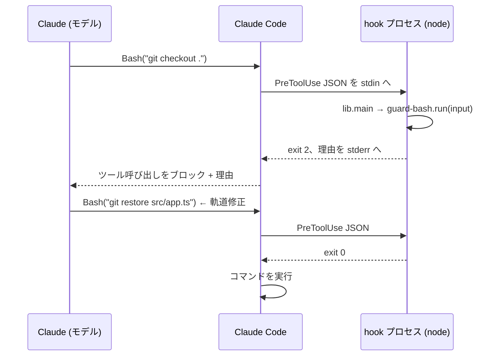

# 設計

[English](design.md)

このドキュメントでは、just-enough-claude-code がなぜこういう形になっているのかを説明します。あえて入れなかったものについても触れます。

## 動機

Claude Code のエージェントハーネスは、放っておくとどこまでも大きくなりがちです。比較対象にした [everything-claude-code (ECC)](https://github.com/affaan-m/ECC) は、agents 64個、skills 262個、登録済みの hooks 約28本に加えて、他のコーディングツール10種類ぶんのアダプターまで同梱しています。これだけの規模は「オペレーターシステム」として使い込むパワーユーザーには確かに頼もしいのですが、その反面、README にはインストールの不具合を解消するための章がまるごと必要になり、新しく使い始めた人が「ツールを呼ぶたびに自分のマシンで何が動いているのか」を把握するのは、まず無理です。

小さなプロジェクトでは、この損得勘定が逆になります。効いてくるのは、ごく薄い層だけです。

1. エージェントがやらかしうる、数少ない致命的な操作（破壊的なシェルコマンドや、シークレットへの書き込みなど）に対するシートベルト
2. エージェントが何に触れたかという記録
3. レビュー・コミット・TDD といった名前付きのワークフロー。よい習慣を、スラッシュコマンドひとつで呼び出せるようにする
4. プロジェクトのコマンドや落とし穴をエージェントに伝えるための CLAUDE.md

これより先は、最適化の話になります。そして、中身を読み切れない最適化は、リスクにしかなりません。この名前に込めたのは、そういう割り切りです。just enough（必要十分）、というわけです。

## 原則

### 1. インストール方法はひとつ

ECC はインストール方法を3つ用意したうえで、「複数の方法を併用するな」と注意書きを添えています。この注意書きが要ること自体が、ひとつの教訓だと思います。本プロジェクトのインストール方法は、ちょうどひとつ、`./install.sh <target>` だけです。何度実行しても結果は同じで、`--force` を付けない限り上書きはせず、既存の `settings.json` も置き換えではなくマージします。グローバルインストールも、プラグインマニフェストも、プロファイルもありません。入り口が少なければ壊れ方も少なく、復旧用の doctor／repair ツールもいらなくなります。

### 2. 信頼する前に、読み切れるサイズに

hook は、条件にマッチするツール呼び出しのたびに、あなたのマシンで任意のコードを実行します。こうしたハーネスを正直にセキュリティレビューする方法は、結局のところ「中身を読む」ことしかありません。だからこそ、一度に読み切れる量に収まっている必要があります。上限ははっきり決めてあります。hook は数本、ファイルは15個ほど、依存はゼロ。この枠を脅かす追加は、何かを削って場所を空けない限り入れません。

### 3. hook は純関数、プロセスの入出力は1モジュールに任せる

どの hook も `run(input) → { exitCode, stderr?, stdout? }` を export するだけで、stdin のパース、例外処理、exit code の受け渡しは共有の `lib.js#main` に任せています。この設計には、次の利点があります。

- **プロセスを起動せずにユニットテストできる。** テスト側はペイロードのオブジェクトを渡して `run()` を呼び、戻り値を確認するだけです。
- **失敗時の振る舞いが1箇所に集まる。** `main()` がすべての例外を受け止めて「許可」に倒します（原則5を参照）。
- **hook が配管コードではなく、ポリシーとして読める。** たとえば `guard-bash.js` は、実質的に `{pattern, reason}` というルールの並びでしかありません。

このパターンは ECC の hook アーキテクチャから拝借しました。ECC を参考にするなら、まずここを真似する価値があると思います。

### 4. 標準でプロジェクトローカル

すべては対象プロジェクトの `.claude/` に入り、コードと一緒にコミットされます。ハーネスはプロジェクトと同じようにバージョン管理され、コードレビューでも普通の変更として diff に出てきますし、プロジェクトごとに中身を変えていけます。`~/.claude/` には何も書き込まないので、あるリポジトリで試したことが別のリポジトリに影響することはありません。アンインストールも `git rm` だけです。実行中に生成されるファイル（`.claude/.session/` や `.claude/logs/`）は、`.claude/` の中に置いた `.gitignore` で除外しています。

### 5. 壊れても止めない、止めるときははっきりと

ここには、性格の違う2つのルールがあります。

- **壊れた hook が、セッションを巻き込んではいけない。** `main()` は hook のクラッシュを飲み込んで、アクションはそのまま通します。ガードはシートベルトのようなものです。気まぐれに車を止めるシートベルトは、いずれ外されてしまいます。そうなれば、シートベルトは無いのと同じです。
- **意図して止めるなら、理由をモデルに伝える。** ブロックは exit code 2 と stderr のメッセージで行い、Claude Code がそれをモデルに渡します。メッセージには、どのルールが働いたのか、なぜそのルールがあるのか、代わりに何をすればよいのか（ユーザーに頼む、あるいは該当する hook ファイルを直す）を書きます。黙って止めると、モデルは同じことを何度も試します。理由を添えて止めれば、別のやり方に切り替えてくれます。

## アーキテクチャ



4本の hook が、セッションのライフサイクルを最初から最後まで覆っています。

| 段階 | Hook | 役割 |
|---|---|---|
| シェルコマンドの実行前 | `guard-bash` | ポリシー: 危険なコマンドを止める |
| ファイル書き込みの前 | `guard-files` | ポリシー: エージェントをシークレットから遠ざける |
| ファイル書き込みの後 | `track-edits` | 観測: 触れたことを記録する |
| ターン終了（Stop） | `session-summary` | 観測: 状態を監査ログにまとめる |

2本のガードはポリシー側で、「ノー」と言えます。残り2本のトラッカーは観測側で、決して「ノー」とは言わず、セッションを止めることもありません（内部で何が失敗しても、最後は必ず「許可」に倒れます）。

シークレットは二段構えで守ります。`guard-files` は hook のレベルで書き込みを止め、`settings.json` の `permissions.deny`（`Read(./.env)` など）はパーミッションのレベルで読み取りを止めます。これで、シークレットの中身がそもそもモデルのコンテキストに入らないようにしています。

## hook の構造

```js
// .claude/hooks/guard-bash.js (抜粋)
const { EXIT_ALLOW, EXIT_BLOCK, main } = require('./lib');

const RULES = [
  { pattern: /\bgit\s+checkout\s+\.\s*$/, reason: 'This discards ALL uncommitted changes...' },
];

function run(input) {
  if (!input || input.tool_name !== 'Bash') return { exitCode: EXIT_ALLOW };
  const command = String(input.tool_input?.command || '');
  for (const rule of RULES) {
    if (rule.pattern.test(command)) {
      return { exitCode: EXIT_BLOCK, stderr: `Blocked by guard-bash hook: ${rule.reason}\n...` };
    }
  }
  return { exitCode: EXIT_ALLOW };
}

if (require.main === module) main(run);   // プロセスへの配線
module.exports = { run, RULES };          // テスト用の入り口
```

この取り決めについて、補足を2つ。

- `run` は、`null` や壊れた入力を渡されても落ちずに「許可」を返す必要があります。これはすべての hook について、マニフェストテストで強制しています。
- exit code を使う方式（0 なら許可、2 ならブロックして stderr をモデルに渡す）は、Claude Code が用意している hook の出力方法のなかで一番シンプルです。`permissionDecision` や `additionalContext` を使うリッチな JSON 出力も検討しましたが、見送りました。このハーネスにそこまでの表現力は要りませんし、exit code 方式のほうが、読む人にとって動きが一目でわかるからです。

## おもな判断とトレードオフ

**hook は bash ではなく Node.js で書く。** hook のペイロードは、stdin に流れてくる JSON です。これを bash で扱おうとすると、`jq` への依存とクォートまわりの罠がついて回ります。Node なら、まともな JSON、まともな正規表現、移植性のあるファイル I/O、それに組み込みのテストランナー（`node --test`）がそのまま使えます。しかも npm の依存はゼロです。代償は、Node 18 以上が必須になること。とはいえ、想定している利用者（小さなソフトウェアプロジェクト）なら、たいてい最初から満たしている条件です。

**これは厳選した denylist であって、セキュリティの境界線ではない。** `guard-bash` のルールはわざと絞ってあり、(a) 明らかに破壊的で、(b) まず意図して打つことのない操作だけを止めます。具体的には、ファイルシステムのルート削除、main への force push、`curl | sh`、`chmod 777`、作業ツリーの全破棄です。正規表現の denylist は、本気で抜けようとする相手には簡単にすり抜けられます。それで構いません。ここで想定しているのは、もっともらしい操作をうっかり実行してしまうエージェントであって、マルウェアではないからです。本当の意味での隔離は、サンドボックスやパーミッション設定の役目です。ルールを増やすほど誤検知で信頼が削れていきますし、ユーザーが「とりあえず無効化」を覚えてしまったガードは、もう何の役にも立ちません。

**インストールでは、置き換えずにマージする。** ハーネスを導入するとき、いちばん危ないのは `settings.json` の衝突です。そこで `merge-settings.js` は控えめに振る舞います。ユーザーのキーが常に優先され、hook のグループはそのコマンドがまだ登録されていないときだけ追加されます（おかげで、再インストールしても結果は変わりません）。和を取るのは `deny` リストだけです。つまりハーネスが、ユーザーに代わって勝手に権限を *付与*（`allow`）することはありません。動くのは、制限する方向だけです。

**規律ではなく、マニフェストテストで担保する。** 設定で駆動するシステムは、登録の内容と実ファイルが少しずつずれていって、いつのまにか壊れます。`tests/manifest.test.js` は、その両方向をチェックします。登録されたスクリプトがすべて実在すること、同梱したスクリプトがすべて登録されていること、どの hook も null 入力の取り決めを守っていること、どの agent／command も正しい形式のフロントマターを持っていること。`settings.json` を直さずに hook をリネームすれば、数週間後にこっそり無効化されていたと気づくのではなく、その場で CI が落ちます。

**入れなかったもの、その理由**

- **自動フォーマットの hook。** どのフォーマッターを使うかはプロジェクトごとに違います。編集のたびに見当違いのツールを動かすハーネスは、邪魔でしかありません。代わりに、CLAUDE.md のテンプレートに、そのプロジェクト自身の lint／format コマンドを書く欄を用意しました。
- **セッションメモリやコンテキストの永続化。** ECC ほどの規模では本当に役立ちますが、hook のなかでもいちばん複雑で壊れやすい部類です。そもそも小さなプロジェクトで、これが要るほど長いセッションになることは稀です。
- **モデルルーティング、コスト追跡、継続学習。** どれも使い込むことを前提にした最適化の層で、「全部読み切れる」という予算をあっという間に食いつぶします。
- **言語ごとの agents／rules**（ECC は約18言語ぶんのパックを同梱）。ワークフローは汎用の agent 3体でまかなえますし、言語固有の決まりごとは、プロジェクトの CLAUDE.md に書くべきものです。
- **プラグインやマーケットプレイスでの配布。** インストール方法が2つ目になること自体が、このプロジェクトがいちばん避けたい落とし穴です。

とはいえ、どれも特定のプロジェクトに足す機能としては良いものです。このハーネスは、設定して使うものではなく、その場で書き換えて使うものとして設計しています。

## テスト戦略

テストは3層で、push のたびに CI で走ります（`node --test`、依存ゼロ）。

1. **ガードのマトリクス。** ガードごとに、許可すべきケースと止めるべきケースを表にしています。判断が紙一重になる組み合わせ（`--force-with-lease` と `--force`、`.env.example` と `.env`、`rm -rf node_modules` と `rm -rf /`）も入れてあります。
2. **パイプラインの結合テスト。** `track-edits` から `session-summary` までを、実際の一時ディレクトリに対して動かします。重複の除去、後片付け、それに悪意あるセッション ID を使ったパストラバーサルのケースまで含みます。
3. **マニフェストの整合性。** settings.json と実ファイルの対応、`run()` の取り決め、フロントマターの形式を確認します。

CI ではこれに加えて、`install.sh` を shellcheck にかけ、使い捨てのディレクトリへ実際にインストールしてみるスモークテストも回しています。

## 拡張

このハーネスは、設定して使うフレームワークではなく、あなたのものになる出発点です。想定している流れはこうです。インストールして、30分かけて読んで、あとはプロジェクトの都合に合わせてその場で書き換えていく。エージェントが怖いことをしたらガードのルールを足し、同じプロンプトを3回打ったと気づいたら command にする。広く役立ちそうな変更なら、PR は歓迎します。そのプロジェクトだけの話なら、リポジトリの `.claude/` に置いておけば十分です。むしろ、それがいちばん収まりのよい置き場所です。
