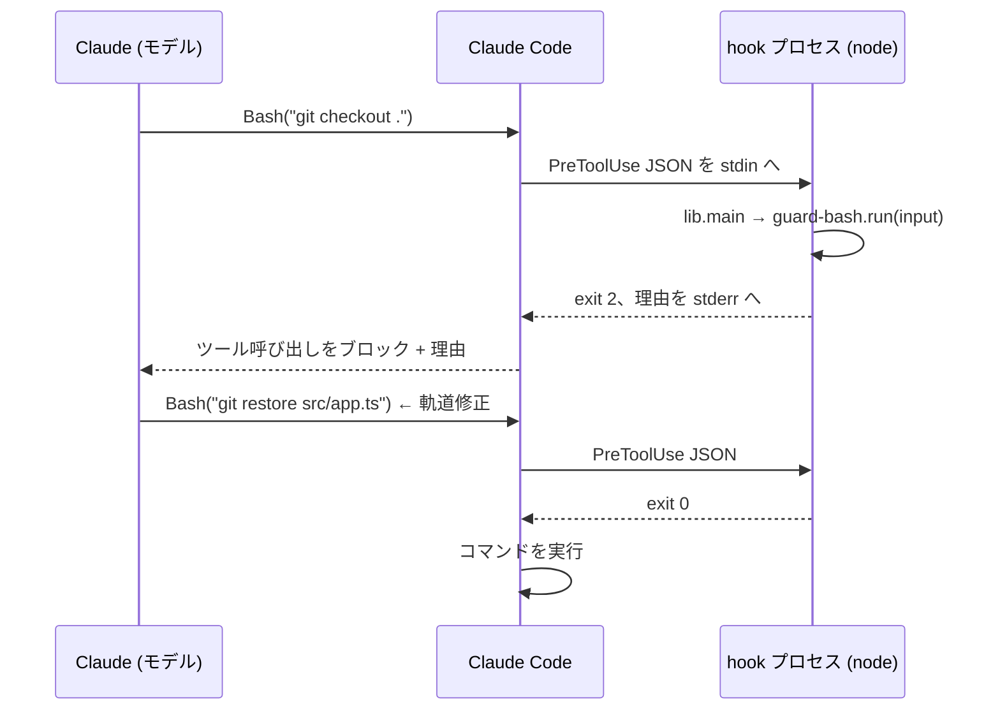

# 設計

[English](design.md)

このドキュメントは just-enough-claude-code がなぜこの形なのかを説明します — 意図的に**入れなかったもの**も含めて。

## 動機

Claude Code 向けのエージェントハーネスは際限なく成長しがちです。本プロジェクトの参照点である [everything-claude-code (ECC)](https://github.com/affaan-m/ECC) は、64 の agents、262 の skills、約 28 の登録済み hooks、さらに他のコーディングツール 10 種へのアダプターを同梱しています。この広さは「オペレーターシステム」を運用するパワーユーザーには本当に有用ですが、README には壊れたインストールを解きほぐすための章が丸ごと必要で、新規ユーザーが「ツール呼び出しのたびに自分のマシンで何が実行されるのか」を監査するのは現実的に不可能です。

小規模プロジェクトでは費用対効果が逆転します。実際に効くのは薄いレイヤーです:

1. エージェントが起こしうる少数の破滅的な行動 (破壊的なシェルコマンド、シークレットへの書き込み) に対する**シートベルト**
2. エージェントが何を触ったかの**監査証跡**
3. いくつかの**名前付きワークフロー** (レビュー、コミット、TDD) — 品質プラクティスをスラッシュコマンド1つの距離に置く
4. エージェントがプロジェクトのコマンドと地雷を知るための **CLAUDE.md**

それ以上は最適化であり、読めない最適化はリスクです。これが名前に込めた賭けです: *just enough (必要十分)*。

## 原則

### 1. インストール経路は1つ

ECC は3つのインストール方法を文書化し、「インストール方法を重ねるな」と警告しています — その警告が存在すること自体が教訓です。本プロジェクトの経路はちょうど1つ: `./install.sh <target>`。冪等で、`--force` なしでは上書きせず、既存の `settings.json` は置き換えずにマージします。グローバルインストールも、プラグインマニフェストも、プロファイルもありません。経路が少なければ壊れた状態も少なく、doctor/repair ツールも不要になります。

### 2. 信頼する前に読み切れるサイズ

hooks はマッチするツール呼び出しのたびに、あなたのマシンで任意のコードを実行します。ハーネスに対する唯一の誠実なセキュリティレビューは「読むこと」です — だからハーネスは一度に読み切れなければなりません。ハードな予算: hooks は数本、約15ファイル、依存ゼロ。この予算を脅かす追加は、何かを押し出さない限り入れません。

### 3. hook は純関数、プロセス I/O は1モジュールが所有する

すべての hook は `run(input) → { exitCode, stderr?, stdout? }` を export し、stdin のパース、例外の捕捉、exit code の配線は共有の `lib.js#main` に委譲します。その帰結:

- **プロセスを起動せずにユニットテスト可能** — テストはペイロードオブジェクトで `run()` を呼び、結果をアサートするだけ。
- **失敗時のポリシーが1箇所に統一** — `main()` はすべての例外を捕捉し「許可」に解決します (原則5参照)。
- **hook が配管ではなくポリシーとして読める** — `guard-bash.js` は実質 `{pattern, reason}` ルールのリストです。

このパターンは ECC の hook アーキテクチャから借用しました。ECC から最も盗む価値のある部分です。

### 4. デフォルトでプロジェクトローカル

すべてが対象プロジェクトの `.claude/` にインストールされ、コードと一緒にコミットされます。ハーネスはプロジェクトと共にバージョン管理され、コードレビューで普通の変更として diff に現れ、プロジェクトごとに分岐できます。`~/.claude/` には何も書かないため、あるリポジトリで試しても他のリポジトリに影響せず、アンインストールは `git rm` です。実行時の生成物 (`.claude/.session/`、`.claude/logs/`) はネストした `.claude/.gitignore` で除外されます。

### 5. 壊れたら開く、ブロックは声高に

2つの非対称なルール:

- **壊れた hook がセッションを壊してはならない。** `main()` は hook のクラッシュを握りつぶしてアクションを許可します。ガードはシートベルトです。ランダムに車を止めるシートベルトはユーザーに外され、そうなればシートベルトは存在しないのと同じです。
- **意図的なブロックはモデルに理由を説明しなければならない。** ブロックは exit code 2 + stderr の理由で行い、Claude Code がそれをモデルにフィードバックします。各メッセージは、*どの*ルールが発火したか、そのルールは*なぜ*存在するか、*代わりに何をすべきか* (ユーザーに頼む、または該当 hook ファイルを編集する) を述べます。沈黙のブロックはリトライループを生み、説明されたブロックは軌道修正を生みます。

## アーキテクチャ



4本の hook がライフサイクルを端から端までカバーします:

| 段階 | Hook | 役割 |
|---|---|---|
| シェルコマンドの実行前 | `guard-bash` | ポリシー: 破滅的コマンドをブロック |
| ファイル書き込みの前 | `guard-files` | ポリシー: エージェントをシークレットから遠ざける |
| ファイル書き込みの後 | `track-edits` | 可観測性: 接触を記録 |
| ターン終了 (Stop) | `session-summary` | 可観測性: 状態を監査ログに集約 |

2本のガードは*ポリシー* (ノーと言える)、2本のトラッカーは*可観測性* (決してノーと言わず、決してセッションを壊さない — 内部のあらゆる失敗パスは「許可」に解決される) です。

シークレットへの多層防御: `guard-files` は hook レベルで**書き込み**をブロックし、`settings.json` の `permissions.deny` ルール (`Read(./.env)` など) はパーミッションレベルで**読み取り**をブロックして、シークレットの内容がモデルのコンテキストに入ること自体を防ぎます。

## hook の解剖

```js
// .claude/hooks/guard-bash.js (抜粋)
const { EXIT_ALLOW, EXIT_BLOCK, main } = require('./lib');

const RULES = [
  { pattern: /\bgit\s+checkout\s+\.\s*$/, reason: 'This discards ALL uncommitted changes...' },
];

function run(input) {
  if (!input || input.tool_name !== 'Bash') return { exitCode: EXIT_ALLOW };
  const command = String(input.tool_input?.command || '');
  for (const rule of RULES) {
    if (rule.pattern.test(command)) {
      return { exitCode: EXIT_BLOCK, stderr: `Blocked by guard-bash hook: ${rule.reason}\n...` };
    }
  }
  return { exitCode: EXIT_ALLOW };
}

if (require.main === module) main(run);   // プロセスへの配線
module.exports = { run, RULES };          // テスト面
```

契約に関する補足:

- `run` は `null` や不正な入力を許容して「許可」を返さなければなりません — これは全 hook に対してマニフェストテストが強制します。
- exit code プロトコル (0 = 許可、2 = ブロック + stderr をモデルへ) は Claude Code の hook 出力オプションの中で最も単純なものです。よりリッチな JSON 出力プロトコル (`permissionDecision`、`additionalContext` など) も検討しましたが採用しませんでした: このハーネスに必要な機能はなく、exit code 形式は読む人にとって自明だからです。

## 主要な設計判断とトレードオフ

**hooks は bash ではなく Node.js。** hook のペイロードは stdin に流れる JSON です。bash で JSON を扱うには `jq` 依存とクォーティングの罠が伴います。Node なら本物の JSON、本物の正規表現、ポータブルなファイル I/O、そして組み込みテストランナー (`node --test`) が手に入ります — npm 依存ゼロで。コスト: Node 18 以上が必須要件になること。対象オーディエンス (小規模なソフトウェアプロジェクト) ではほぼ常に既に満たされています。

**厳選された denylist であって、セキュリティ境界ではない。** `guard-bash` のルールは意図的に少なく、(a) 明らかに破壊的で (b) ほぼ確実に意図されていないものだけをブロックします: ファイルシステムルートの削除、main への force push、`curl | sh`、`chmod 777`、作業ツリー全体の破棄。正規表現の denylist は本気の攻撃者には簡単に回避されます — それで構いません。脅威モデルは*もっともらしい間違いを犯すエージェント*であって、マルウェアではないからです。本当の隔離はサンドボックスとパーミッション設定の仕事です。ルールを増やすと偽陽性で信頼が削られ、ユーザーが無効化を学習したガードは無価値になります。

**インストール時は置き換えずマージ。** ハーネス導入で最もリスクが高い瞬間は `settings.json` の衝突です。`merge-settings.js` は保守的です: ユーザーのキーが常に勝ち、hook グループはそのコマンドが未登録の場合のみ追加され (これが再インストールの冪等性も生む)、union されるのは `deny` リストだけ — ハーネスがユーザーに代わって勝手にパーミッションを*付与* (`allow`) することは決してなく、制限する方向にしか動きません。

**規律ではなくマニフェストテスト。** 設定駆動のシステムは、登録とファイルが乖離して腐ります。`tests/manifest.test.js` は双方向をアサートします: 登録された全スクリプトが実在し、同梱された全スクリプトが登録されており、全 hook が null 入力契約を守り、全 agent/command が整形式のフロントマターを持つこと。`settings.json` を更新せずに hook をリネームすれば、数週間後に気づくサイレントな無効化ではなく、CI の失敗になります。

**入れなかったもの、その理由:**

- *自動フォーマット hook* — フォーマッターの選択はプロジェクト固有で、毎回の編集で外れたツールを起動するハーネスは摩擦そのものです。代わりに CLAUDE.md テンプレートにプロジェクト自身の lint/format コマンドを書く欄があります。
- *セッションメモリ / コンテキスト永続化* — ECC のスケールでは真に有用ですが、hook の中で最も複雑で最も壊れやすいカテゴリであり、小規模プロジェクトでそれを必要とするほど長いセッションは稀です。
- *モデルルーティング、コスト追跡、継続学習* — ヘビーユースを前提とした最適化レイヤーで、どれも「全部読める」予算を倍増させます。
- *言語別の agents / rules* (ECC は約18言語パックを同梱) — 3体の汎用 agent がワークフローをカバーし、言語の規約はプロジェクトの CLAUDE.md に書くべきものです。
- *プラグイン / マーケットプレイス配布* — 2つ目のインストール経路は、まさに本プロジェクトが避けるために存在する footgun です。

これらはどれも*特定のプロジェクトへの追加*としては良いものです — このハーネスは設定するものではなく、その場で編集するものとして設計されています。

## テスト戦略

3層構成で、push のたびに CI で実行されます (`node --test`、依存ゼロ):

1. **ガードのマトリクス** — 各ガードについて、許可すべきケースとブロックすべきケースの表。重要な紙一重のケースを含みます (`--force-with-lease` と `--force`、`.env.example` と `.env`、`rm -rf node_modules` と `rm -rf /`)。
2. **パイプライン統合** — `track-edits` → `session-summary` を実際の一時ディレクトリに対して実行。重複排除、クリーンアップ、悪意あるセッション ID によるパストラバーサルのケースを含みます。
3. **マニフェスト整合性** — settings.json ↔ ファイル、`run()` 契約、フロントマターの形。

CI ではさらに `install.sh` の shellcheck と、スクラッチディレクトリへのスモークインストールを行います。

## 拡張

このハーネスはあなたが所有するスタート地点であって、設定するフレームワークではありません。想定するライフサイクル: インストールし、読み (30分)、プロジェクトのニーズが現れたらその場で編集する — エージェントが怖いことをしたらガードルールを足し、同じプロンプトを3回繰り返したら command を足す。汎用的に有用な変更なら PR を歓迎します。プロジェクト固有なら、あなたのリポジトリの `.claude/` に置いておけばいい — それこそが正しい置き場所です。
