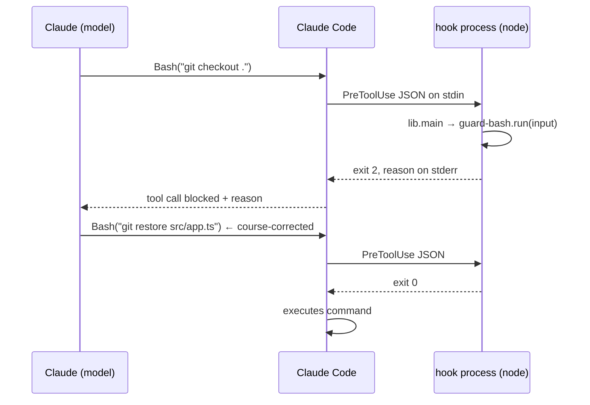

# Design

[日本語版](design.ja.md)

This document explains why just-enough-claude-code looks the way it does — including what was deliberately left out.

## Motivation

Agent harnesses for Claude Code tend to grow without bound. The reference point for this project, [everything-claude-code (ECC)](https://github.com/affaan-m/ECC), ships 64 agents, 262 skills, ~28 registered hooks, and adapters for ten other coding tools. That breadth is genuinely useful for a power user running an "operator system" — but its README needs an entire section for untangling broken installs, and a newcomer cannot realistically audit what will execute on their machine on every tool call.

For a small project the cost-benefit is inverted. What actually moves the needle is a thin layer:

1. a **seatbelt** against the few catastrophic actions an agent can take (destructive shell commands, writing to secrets),
2. a **paper trail** of what the agent touched,
3. a few **named workflows** (review, commit, TDD) so quality practices are one slash-command away,
4. a **CLAUDE.md** so the agent knows the project's commands and landmines.

Everything beyond that is optimization, and optimization you cannot read is risk. Hence the bet in the name: *just enough*.

## Principles

### 1. One install path

ECC documents three install methods and warns "do not stack install methods" — the existence of that warning is the lesson. This project has exactly one: `./install.sh <target>`. It is idempotent, never overwrites without `--force`, and merges (rather than replaces) an existing `settings.json`. There is no global install, no plugin manifest, no profiles. Fewer paths means fewer broken states means no doctor/repair tooling needed.

### 2. Small enough to read before you trust it

Hooks execute arbitrary code on your machine on every matching tool call. The only honest security review for a harness is reading it — so the harness must be readable in one sitting. Hard budget: a handful of hooks, ~15 files, no dependencies. Anything that threatens the budget needs to displace something else.

### 3. Hooks are pure functions; one module owns process I/O

Every hook exports `run(input) → { exitCode, stderr?, stdout? }` and delegates stdin parsing, error trapping, and exit-code wiring to a shared `lib.js#main`. Consequences:

- **Unit-testable without spawning processes** — tests call `run()` with a payload object and assert on the result.
- **Uniform failure policy in one place** — `main()` traps all exceptions and resolves them to "allow" (see principle 5).
- **Hooks read as policy, not plumbing** — `guard-bash.js` is essentially a list of `{pattern, reason}` rules.

This pattern is borrowed from ECC's hook architecture, which is the part of ECC most worth stealing.

### 4. Project-local by default

Everything installs into the target project's `.claude/`, which is committed alongside the code. The harness version-controls with the project, diffs in code review like any other change, and varies per project. Nothing is written to `~/.claude/`, so trying the harness on one repo cannot affect another — and uninstalling is `git rm`. Runtime artifacts (`.claude/.session/`, `.claude/logs/`) are excluded via a nested `.claude/.gitignore`.

### 5. Fail open, block loud

Two asymmetric rules:

- **A broken hook must not break the session.** `main()` swallows hook crashes and allows the action. A guard is a seatbelt; a seatbelt that randomly stops the car gets removed by its user, and then there is no seatbelt at all.
- **A deliberate block must explain itself to the model.** Blocks use exit code 2 with the reason on stderr, which Claude Code feeds back to the model. Each message states *what* rule fired, *why* it exists, and *what to do instead* (ask the user, or edit the named hook file). A silent block produces retry loops; an explained block produces course correction.

## Architecture



The four hooks cover the lifecycle end to end:

| Stage | Hook | Role |
|---|---|---|
| Before a shell command | `guard-bash` | policy: block catastrophic commands |
| Before a file write | `guard-files` | policy: keep agents out of secrets |
| After a file write | `track-edits` | observability: record the touch |
| Turn end (Stop) | `session-summary` | observability: fold state into an audit log |

The two guards are *policy* (they can say no); the two trackers are *observability* (they may never say no, and never crash the session — every failure path in them resolves to allow).

Defense in depth on secrets: `guard-files` blocks **writes** at hook level, while `permissions.deny` rules in `settings.json` block **reads** (`Read(./.env)` etc.) at the permission level, keeping secret contents out of the model's context entirely.

## Anatomy of a hook

```js
// .claude/hooks/guard-bash.js (abridged)
const { EXIT_ALLOW, EXIT_BLOCK, main } = require('./lib');

const RULES = [
  { pattern: /\bgit\s+checkout\s+\.\s*$/, reason: 'This discards ALL uncommitted changes...' },
];

function run(input) {
  if (!input || input.tool_name !== 'Bash') return { exitCode: EXIT_ALLOW };
  const command = String(input.tool_input?.command || '');
  for (const rule of RULES) {
    if (rule.pattern.test(command)) {
      return { exitCode: EXIT_BLOCK, stderr: `Blocked by guard-bash hook: ${rule.reason}\n...` };
    }
  }
  return { exitCode: EXIT_ALLOW };
}

if (require.main === module) main(run);   // process wiring
module.exports = { run, RULES };          // test surface
```

Notes on the contract:

- `run` must tolerate `null`/malformed input and return allow — enforced for every hook by a manifest test.
- The exit-code protocol (0 = allow, 2 = block + stderr to the model) is the simplest of Claude Code's hook output options. The richer JSON output protocol (`permissionDecision`, `additionalContext`, …) was considered and rejected: nothing in this harness needs it, and the exit-code form is self-evident to a reader.

## Key decisions and trade-offs

**Node.js for hooks, not bash.** Hook payloads are JSON on stdin; parsing JSON in bash means a `jq` dependency and quoting traps. Node gives real JSON, real regex, portable file I/O, and a built-in test runner (`node --test`) — zero npm dependencies. Cost: Node ≥ 18 becomes a requirement. For the target audience (small software projects) that is nearly always already true.

**A curated denylist, not a security boundary.** `guard-bash` rules are deliberately few and only block things that are (a) clearly destructive and (b) almost never intended: filesystem-root deletes, force-push to main, `curl | sh`, `chmod 777`, whole-tree discards. A regex denylist is trivially bypassable by a determined adversary — that's fine, because the threat model is *an agent making a plausible-looking mistake*, not malware. Real isolation belongs to sandboxes and permission settings, not to this hook. Growing the list erodes trust through false positives, and a guard users learn to override is worthless.

**Merge, don't replace, on install.** The riskiest moment of harness adoption is `settings.json` collision. `merge-settings.js` is conservative: user keys always win, hook groups are appended only if their commands aren't already registered (which also makes re-installation idempotent), and only the `deny` list is unioned — the harness will never silently *grant* a permission (`allow`) on your behalf, only restrict.

**Manifest tests over discipline.** Config-driven systems rot when registration and files drift apart. `tests/manifest.test.js` asserts both directions: every registered script exists, every shipped script is registered, every hook honors the null-input contract, and every agent/command has well-formed frontmatter. Renaming a hook without updating `settings.json` is a CI failure, not a silent no-op discovered weeks later.

**What was left out, and why:**

- *Auto-formatting hooks* — formatter choice is project-specific; a harness guessing wrong on every edit is friction. The CLAUDE.md template has a slot for the project's own lint/format command instead.
- *Session memory / context persistence* — genuinely valuable at ECC scale, but it is the most complex and most failure-prone hook category, and small projects rarely have sessions long enough to need it.
- *Model routing, cost tracking, continuous learning* — optimization layers that assume heavy usage; each would multiply the read-the-whole-thing budget.
- *Per-language agents and rules* (ECC ships ~18 language packs) — three general agents cover the workflows; language conventions belong in the project's CLAUDE.md.
- *A plugin/marketplace distribution* — a second install path is exactly the footgun this project exists to avoid.

Each of these is a fine *addition for a specific project* — the harness is designed to be edited in place, not configured.

## Testing strategy

Three layers, all running in CI on every push (`node --test`, no dependencies):

1. **Guard matrices** — for each guard, a table of must-allow and must-block cases, including the near-misses that matter (`--force-with-lease` vs `--force`, `.env.example` vs `.env`, `rm -rf node_modules` vs `rm -rf /`).
2. **Pipeline integration** — `track-edits` → `session-summary` run against a real temp directory, including dedup, cleanup, and a hostile-session-id path-traversal case.
3. **Manifest consistency** — settings.json ↔ files, the `run()` contract, frontmatter shape.

CI additionally shellchecks `install.sh` and performs a smoke install into a scratch directory.

## Extending

The harness is a starting point you own, not a framework you configure. The intended lifecycle: install it, read it (30 minutes), then edit it as project needs emerge — add a guard rule when the agent does something scary, add a command when you repeat a prompt three times. If a change is generally useful, PRs are welcome; if it's project-specific, it just lives in your repo's `.claude/`, which is exactly where it belongs.
